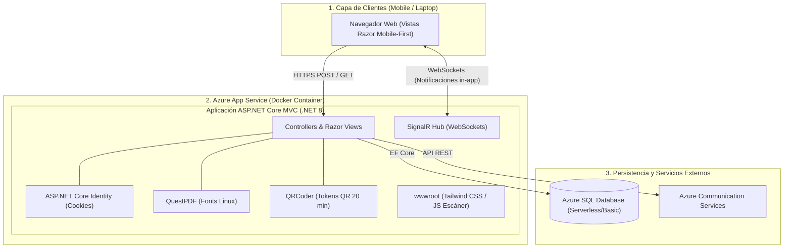
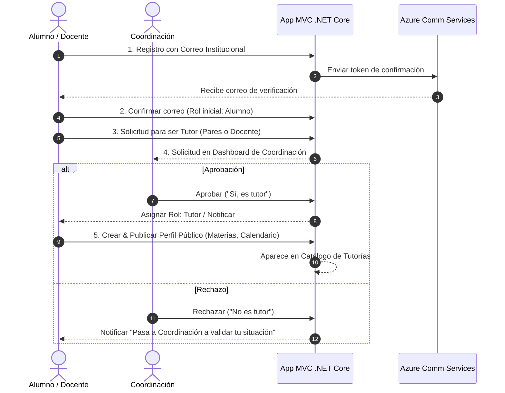

# 📐 ARCHITECTURE.md — Proyecto Tutorías (.NET 8 MVC + Docker)

Este documento define la arquitectura, decisiones tecnológicas y convenciones del **Sistema de Tutorías Académicas**, optimizado para el desarrollo ágil asistido por Inteligencia Artificial (*Vibe Coding*).

---

## 🎯 1. Visión General del Proyecto

* **Propósito:** Sistema de gestión e interacción de tutorías entre **Alumnos**, **Tutores** (Alumnos y Docentes) y **Coordinación**, accesible desde dispositivos móviles y laptops.
* **Modalidad de Desarrollo:** Vibe Coding asistido por IA (código limpio, modular, fuertemente tipado y autoverificable).
* **Diseño:** Monolito unificado ASP.NET Core MVC, responsivo (*Mobile-First*) y con alta interactividad en tiempo real.

---

## 🛠️ 2. Stack Tecnológico

| Capa | Tecnología | Descripción / Razón de Selección |
| :--- | :--- | :--- |
| **Backend & Web** | **.NET 8 LTS (MVC)** | ASP.NET Core MVC con Controladores y Vistas Razor (`.cshtml`). |
| **Estilos UI** | **Tailwind CSS** | Diseño responsivo *Mobile-First* fluido en Vistas Razor. |
| **Base de Datos** | **Azure SQL Database** | Administrado en Azure (Nivel Serverless / Basic 5 DTU). |
| **ORM** | **Entity Framework Core** | Manejo de migraciones, relaciones y Fluent API. |
| **Autenticación** | **ASP.NET Core Identity** | Control de acceso basado en Roles (`Admin/Coordinador`, `Tutor`, `Alumno`). |
| **Real-time** | **SignalR Hub** | Comunicación bidireccional vía WebSockets para notificaciones in-app y confirmación manual. |
| **PDFs** | **QuestPDF** | Motor de generación de reportes e historiales en PDF. |
| **Códigos QR** | **QRCoder + html5-qrcode** | Generación de tokens QR dinámicos (expiración 20 min) y escáner JS en cliente. |
| **Notificaciones** | **Azure Communication Services** | Envío de correos electrónicos transaccionales y tokens de verificación. |
| **Contenedor** | **Docker (2-Stage Build)** | Empaquetado unificado directo: .NET 8 SDK compila la app y sirve HTML/CSS/JS (`wwwroot`). |
| **Hosting Cloud** | **Azure App Service for Containers** | Despliegue de contenedor único integrado con Azure Container Registry (ACR). |

---

## 🏗️ 3. Diagrama de Arquitectura de Despliegue



---

## 📂 4. Estructura de Carpetas Unificada (`tutorias/`)

```text
tutorias/
├── Controllers/                 # Manejan rutas, lógica de vistas y respuestas JSON
│   ├── AccountController.cs     # Registro, Login, Validación de Correo
│   ├── TutoriasController.cs    # Catálogo, Solicitud de Tutor, Calendario
│   ├── AsistenciaController.cs  # Generación de QR (TOTP) y Pase de lista
│   └── CoordinacionController.cs# Dashboard de aprobación y métricas
│
├── Views/                       # Interfaz de usuario (Vistas Razor Mobile-First)
│   ├── Shared/_Layout.cshtml    # Menú y plantilla base responsiva
│   ├── Account/                 # Login, Registro, Confirmación
│   ├── Tutorias/                # Catálogo, Perfil Público, Calendario
│   ├── Asistencia/              # Pantalla de QR dinámico y Escáner JS
│   └── Coordinacion/            # Dashboard de métricas y aprobaciones
│
├── Models/                      # Entidades del dominio y ViewModels
│   ├── ApplicationUser.cs       # Extensión de IdentityUser (Alumno/Tutor/Coordinación)
│   ├── TutorPerfil.cs           # Perfil público, materias, horario
│   ├── SesionTutoria.cs         # Tutorías (Entre Pares, Individual, Especial)
│   └── Asistencia.cs            # Registro de asistencia y encuestas
│
├── Data/                        # EF Core DbContext y Migraciones SQL
│   ├── ApplicationDbContext.cs
│   └── Migrations/
│
├── Services/                    # Lógica de Negocio Reutilizable
│   ├── QuestPdfService.cs       # Generador de reportes PDF
│   ├── QrCodeService.cs         # Generador de tokens QR (TOTP 20 min)
│   └── EmailService.cs          # Azure Communication Services
│
├── Hubs/                        # SignalR Hub para notificaciones en tiempo real
│   └── NotificationHub.cs
│
├── wwwroot/                     # Archivos estáticos
│   ├── css/                     # Estilos Tailwind CSS
│   ├── js/                      # Escáner de QR JS, cliente SignalR
│   └── lib/
│
├── Program.cs                   # Configuración de servicios y middlewares
├── Dockerfile                   # Imagen Docker de 2 etapas (.NET 8 SDK + Runtime)
└── tutorias.csproj              # Proyecto C#
```

---

## 🐳 5. Estrategia de Docker (Contenedor Unificado MVC)

El `Dockerfile` utiliza una construcción en **2 etapas** (.NET 8 puro):

1. **Stage 1 (.NET SDK):** Compila la aplicación MVC de .NET 8 con `dotnet publish -c Release -o /app/publish`.
2. **Stage 2 (.NET Runtime + Linux Fonts):**
   * Imagen base: `mcr.microsoft.com/dotnet/aspnet:8.0`
   * Instalación de dependencias de renderizado de fuentes para **QuestPDF**:
     `apt-get update && apt-get install -y fontconfig libfontconfig1`
   * Expone el puerto `8080`.

---

## 👥 6. Flujo de Negocio: Registro y Aprobación (Tutoría entre Pares / Docentes)



---

## 📚 7. Tipos de Tutorías y Reglas de Negocio

| Tipo de Tutoría | Impartido Por | Proceso de Alta / Aprobación | Capacidad / Restricción | Funcionalidades Habilitadas |
| :--- | :--- | :--- | :--- | :--- |
| **Tutoría entre Pares** | Alumno Tutor | Solicitud aprobada por Coordinación | Capacidad definida por el tutor / salón | Calendario, Asistencia (QR/Manual), Encuestas, Reputación. |
| **Tutoría Individual** | Docente Tutor | Solicitud aprobada por Coordinación | **Máximo 10 alumnos inscritos por tutoría** | Calendario, Asistencia (QR/Manual), Encuestas, Reputación. |
| **Tutoría Especial** *(ej. Regularización)* | Coordinación | Creadas directo por Coordinación | N/A | **Solo visibilidad en Catálogo** (sin asistencias ni encuestas). |

---

## ⏱️ 8. Sistema de Asistencia (QR Dinámico vs. Manual)

1. **QR Dinámico (20 min):** Vence cada 20 min usando TOTP. El alumno escanea y registra automáticamente datos (Nombre, Boleta, Carrera, Materia, Fecha/Hora).
2. **Asistencia Manual:** El tutor busca al alumno e inicia una notificación in-app (SignalR) que el alumno confirma desde su móvil.
3. **Encuesta de Satisfacción (1-5 Estrellas):** Se dispara automáticamente al finalizar la clase para actualizar la reputación del tutor.

---

## 🤖 9. Reglas para el Desarrollo con IA (*Vibe Coding Rules*)

1. **Tipado Estricto C#:** Prohibido usar `dynamic` o `object` sin tipar.
2. **Vistas y Controladores Delgados (<200 líneas):** Separar lógica pesada en `Services/`.
3. **Diseño Mobile-First en Razor:** Usar clases responsivas de Tailwind CSS (`sm:`, `md:`, `lg:`).
4. **Respuesta Explícita y Validaciones:** Usar `ModelState` y ViewModels fuertemente tipados.
